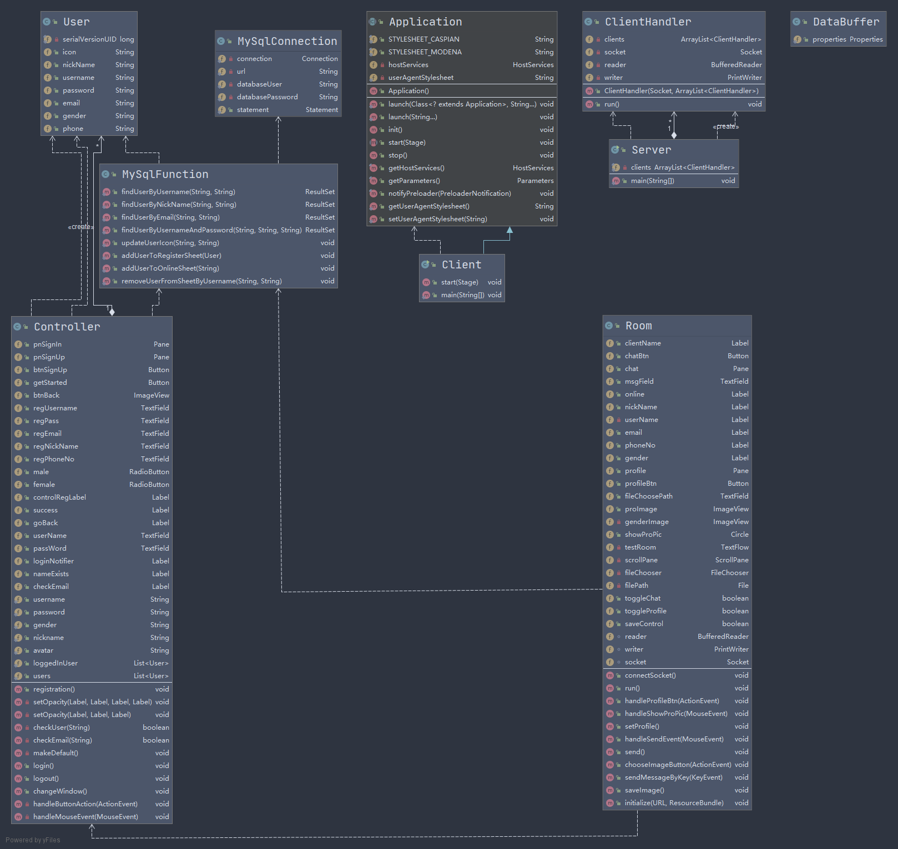
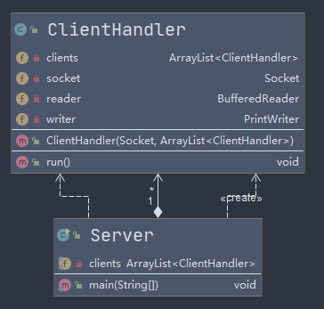
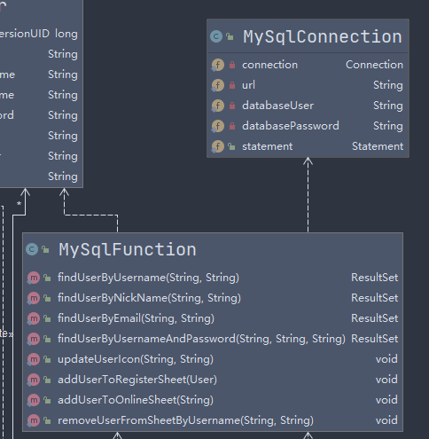
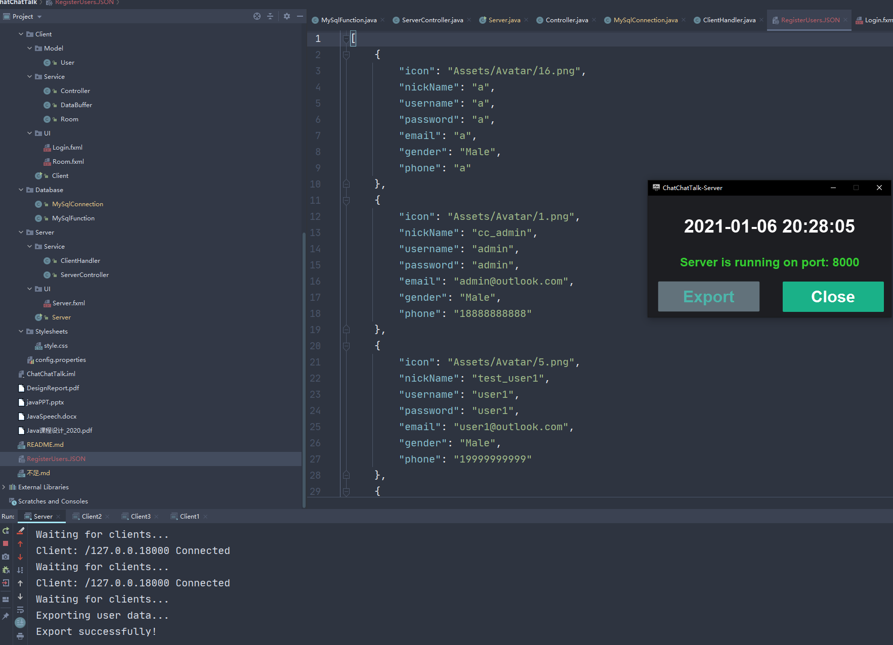
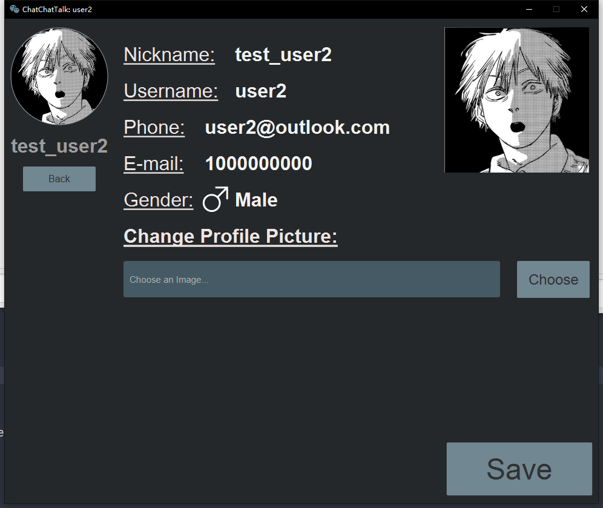
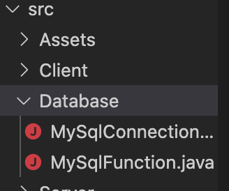
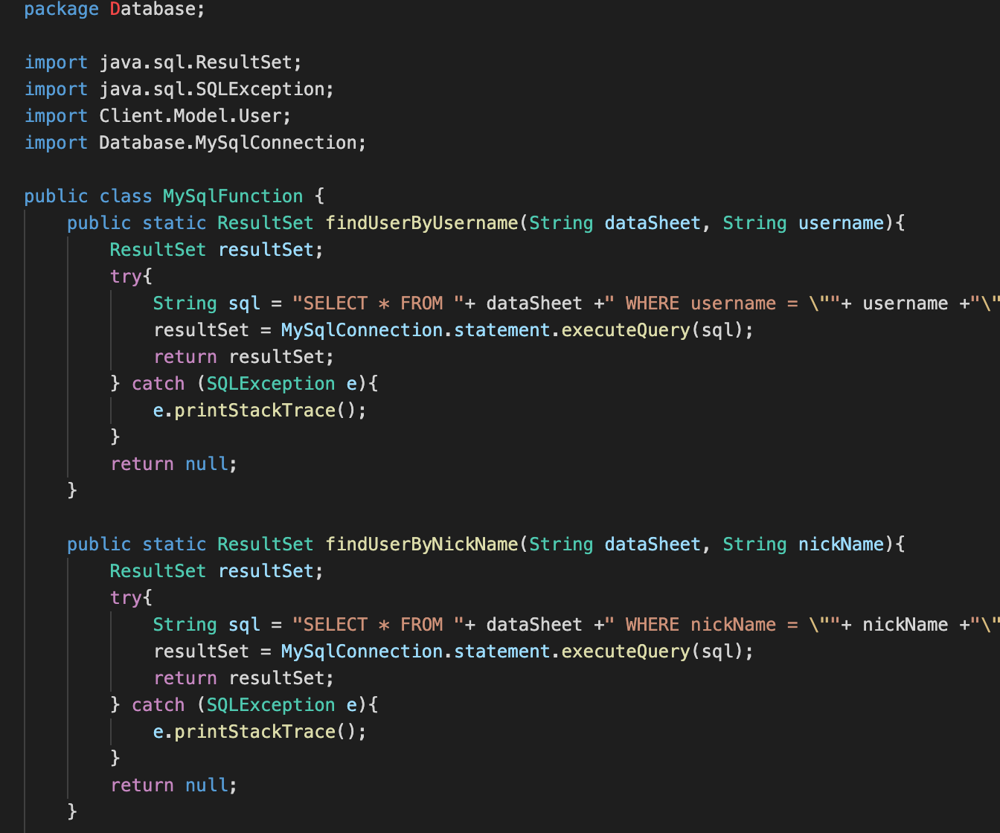
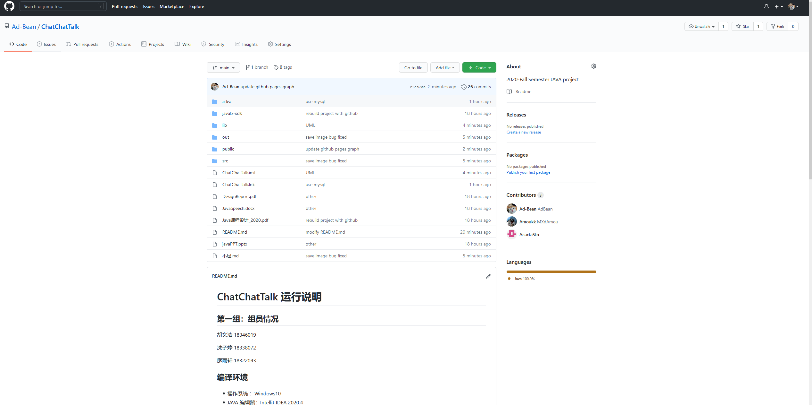

# ChatChatTalk

## 项目背景介绍

Chat Chat Talk 是一个使用 Java 语言编写的网络聊天室，我们的聊天室实现了前后端分离，具有**服务端监控、注册、登入、登出、群聊、更换头像、发送信息、导出用户信息**等功能。

Chat Chat Talk 的灵感来源于 Web 课程的的登入登出作业、网络聊天室、日常生活中使用的各类聊天软件，以及 material design 的设计原则。

我们采取了**前后端分离**的形式:

- 由廖雨轩负责**前端**进行页面布局，CSS，FXML 的编写和与后台对接

- 由胡文浩负责**客户端**的书写、后台接口的实现和与前端对接

- 由冼子婷负责**服务端**的书写、产品的设计和文档的编写

## 项目环境说明

- 操作系统 ：**Windows10**
- JAVA 编辑器：**IntelliJ IDEA 2020.4**
- JAVA 版本 ：**javaJDK 15.01 - java15**
- 依赖：**javaFX** **MySql** AnimateFX commons-lang fontawesome jfoenix

> 编译运行参数与依赖已导入 IDEA，若出现编译问题请参照 javaFX 文档 https://openjfx.io/openjfx-docs/ 
>
> 或CSDN https://blog.csdn.net/weixin_43616817/article/details/106668473 进行 IDEA 的配置
>
> 具体**运行说明文档**已在README.md / ChatChatTalk程序运行说明文档.pdf 中说明，此处便不再赘述。
>

## 系统功能介绍

ChatChatTalk 主要有四个界面，分别为**服务端界面**，**注册界面**，**登陆界面**，**聊天界面**，更换及修改**个人信息**界面。

运行Client类，便可启动至**登陆界面**。登陆界面有 Register 和 Login 的按钮，意为注册和登陆：

- **已注册且不在线的用户**可通过填写 Username 和 Password 一栏后，点击 Login 按钮完成登入，登入后自动跳转至聊天界面。
- **未注册用户**，则需点击 Register 注册个人账户， 并在注册页面处完成 NickName , Username, Password, Email, Phone Number, Gender 处填写相应信息即可完成注册。


跳转至聊天界面后，可见左边黑色一览的 用户头像、用户名、Profile 按钮，以及右侧的聊天信息和聊天输入框。

- 单击 **Profile** 或 **头像** 进入个人信息页面
- 在修改个人信息处可以选择**更换头像**
- 在右侧聊天框输入信息后按下 enter 键 或 传送图标即可发出信息

发送信息后可在上方聊天区域看到其他进入聊天室用户的发送的消息和自己发送的消息与**时间戳**，其中为了区分，**自己发送的消息带有自己的头像且字体颜色为绿色**。他人发送的消息会显示他人的头像和字体设置为黑色以作区分。

当消息列表过长时，需要通过拖动滚动条下拉看到所有发送的消息。

## 项目结构说明

- 目录树：

```bash
.
├── ChatChatTalk.iml
├── ChatChatTalk.lnk
├── README.md
├── out
│   ├── artifacts
│   │   └── JavaFXApp
│   │       └── JavaFXApp.jar
│   └── production
├── public
├── src
│   ├── Assets
│   │   ├── Avatar
│   │   ├── Chat.png
│   │   ├── female.png
│   │   ├── file.png
│   │   ├── icons8-sent.png
│   │   ├── male.png
│   │   ├── password.png
│   │   ├── registration.png
│   │   ├── user.png
│   │   ├── username.png
│   │   └── wechat.png
│   ├── Client
│   │   ├── Client.java
│   │   ├── Model
│   │   │   └── User.java
│   │   ├── Service
│   │   │   ├── Controller.java
│   │   │   ├── DataBuffer.java
│   │   │   └── Room.java
│   │   └── UI
│   │       ├── Login.fxml
│   │       └── Room.fxml
│   ├── Database
│   │   ├── MySqlConnection.java
│   │   └── MySqlFunction.java
│   ├── Server
│   │   ├── Server.java
│   │   └── Service
│   │       └── ClientHandler.java
│   ├── Stylesheets
│   │   └── style.css
│   └── config.properties
└── 不足.md

```

## 系统类图



## 关键模块说明

### 1. Server



> Server模块是客户端之间的消息中转站，负责与各个客户端建立连接，启动线程监听客户端的行为，并且将一个客户端发送的消息转发至其他的各个客户端。使用了多线程启动服务端界面，用于区分监听客户端的请求。

### 2. Client


> Client模块负责启动客户端的GUI并创建与服务器的连接，启动线程监听用户在客户端GUI上的各种行为，并作出响应。

### 3. MySQL



> MySQL模块提供了用户信息的保存功能，省去文件读取和写入的操作，使得信息的查询、更改、保存更加的简洁和方便。

## 知识点应用说明

### 1. 类和对象

#### Server 服务端

```java
Server.Server

Server.Service
    Server.Service.ClientHandler
    Server.Service.ServerController
Server.UI
    Server.fxml
    
Server
```

#### Client 客户端

```java
Client.Model
    Client.Modal.User

Client.Service
	Client.Service.Controller
     Client.Service.DataBuffer
     Client.Service.Room
     Client.Service.UserDataService

Client.UI
    Login.fxml
    Room.fxml

Client
```

#### MySql (JavaJDBC)

```java
Database
    Database.MySqlConnection
    Database.MysqlFunction
```


### 2. 超类与继承

ClientHandler 继承了 Thread 类，不断监听客户端的接入。

Client 继承了 Application 类，使用 JavaFX 实现了图形界面。

### 3. 接口及其实现

UserDataService, User 实现了 Serializable 接口，采取序列化。

Room 实现了 Initializable 接口，对接 JavaFX 图形界面，进行联系与发送数据。

### 4. 异常处理

Server 进行对 ServerSocket 与 Socket 的异常处理，ClientHandler, UserDataService, DataBuffer 进行对输入输出流的异常处理

### 5. 多线程

ClientHandler 采取多线程的方式处理客户端的信息。

Server采用了多线程的方式启动图形界面，与监听客户端请求区分开。

在 Room 中使用了 Platform.runlater 意味着如果需要从非 GUI 线程更新 GUI 组件，使用它将您的更新放在队列中，并且它将由 GUI 线程尽快处理。

### 6. 文件存储

在服务端监控页面，可以点击Export按钮，以**JSON格式**导出所有用户信息。



### 7. 网络编程

使用 ServeSocket 与 Socket 实现了网络聊天室

### 8. Java 图形界面

使用 [JavaFX](https://openjfx.io/) 实现 Java 图形界面，使用 Scene Builder 辅助设计，采取 Material Design 设计风格，引入了 **AnimateFX**, commons-lang, fontawesomefx, jfoenix 等库优化，美观图形界面。

> JavaFX 是一个开源的下一代客户端应用程序平台，适用于基于 Java 的桌面、移动端和嵌入式系统。





### 9. Java JDBC

采用了Mysql数据库进行对**用户的数据管理和存储**，具体实现请查看Database包中源码。






## 创新点或技术难点说明

1. 使用 [JavaFX](https://openjfx.io/), Scene Builder, Material Design 实现 **Java 图形界面**，并且引入了 **AnimateFX**, commons-lang, fontawesomefx, jfoenix 等库优化，图形界面较为美观，并且带有CSS与动画效果，更为**现代**。尽管如今用 java 做桌面平台应用以为少数，但我们认为在**开源**背景下的 javaFX 仍然有可用空间与前景。
2. 采取类似**网络应用开发的前后端分离的形式**，使用 **git 进行版本管理**，由廖雨轩负责前端进行页面布局，CSS，FXML 的编写和与后台对接，由胡文浩负责**客户端**的编写、后台接口的实现和与前端对接，由冼子婷负责**服务端**的编写、产品的设计和文档的编写。
3. 采用git进行版本管理，并且**开源到github**上：

## 存在不足的地方及展望

#### 1.已解决的难点
- [x] 无法显示他人头像

> 解决方案：采用 MySql 建立数据库，方便获取用户头像与数据

- [x] 无法使用中文路径、中文名称的头像（多次测试后可行）
- [x] 保存头像
- [x] 登录失败也会重复登录，已经登陆的提示不对，需要更改提示和错误类型
- [x] 退出并不会退出 onlineuser
- [x] full name 只在简介出现而非用户界面与聊天室，登录实际上用的 username

> 已解决：聊天界面标题显示 username，头像下方为 nickname，聊天均采用 nickname

- [x] 升级 mysql 采用 Java JDBC
- [x] 为服务端写页面，并且写一个电子时钟显示。

#### 2.未解决的难点
- [ ] 消息队列过多时，无法自动定位到最新的消息。

> 解决方案：清空 textflow 的历史消息（需要每个用户保存聊天记录，可以采用文件存储方式写在本地 txt）
>
>  已知无法换成 textArea，且使用 ScrollPane 也无法解决

- [ ] 文件群发功能还未实现 
- [ ] 更换头像具有限制，仅能更换且保存处于Assets/Avatar下的头像，否则下次因路径问题无法登陆。

#### 3.展望
1. 聊天中添加Emoji表情的发送
2. 能在聊天室实现文件传送的功能